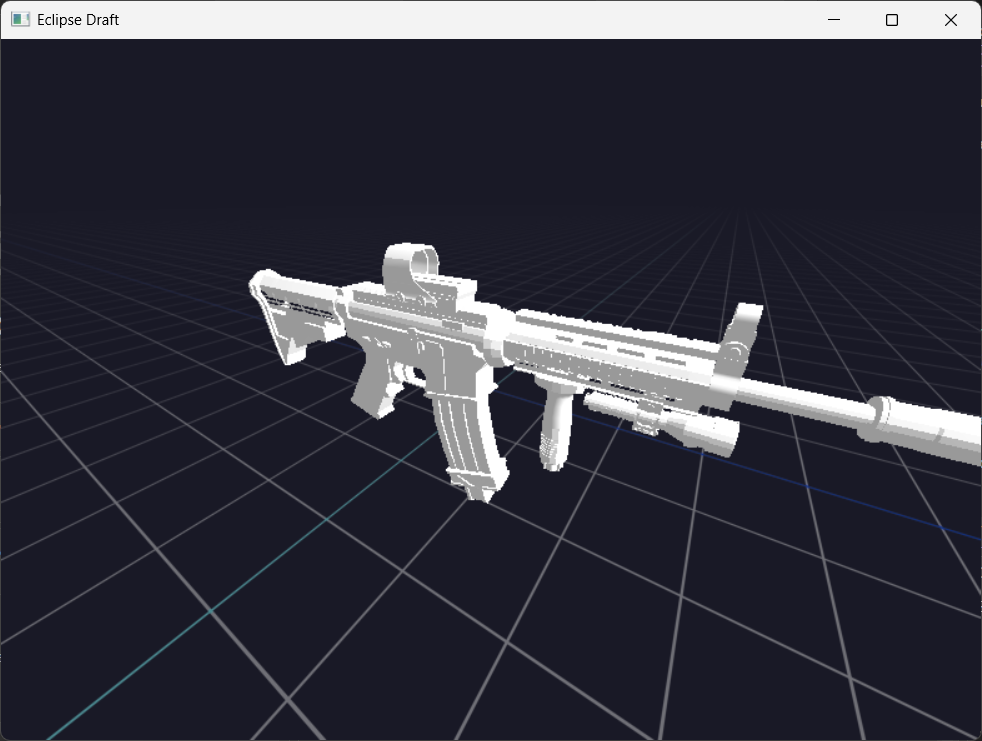

# Eclipse Draft  

**Eclipse Draft** is a custom 3D editor/engine with deep integration of Win32 and DirectX 11/12, written from scratch in C++. Currently about 10% complete, it supports multithreaded rendering, model import (.OBJ), a procedural grid, multi‑viewport rendering, and a customizable architecture.

